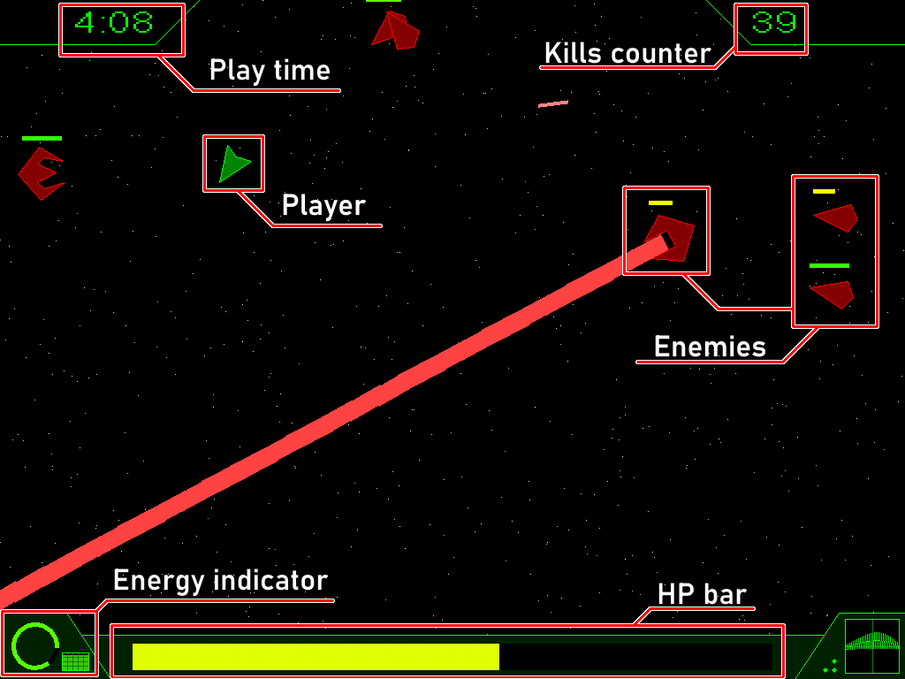
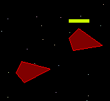
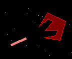
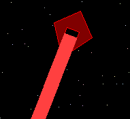
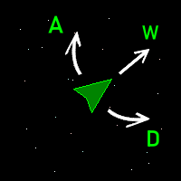
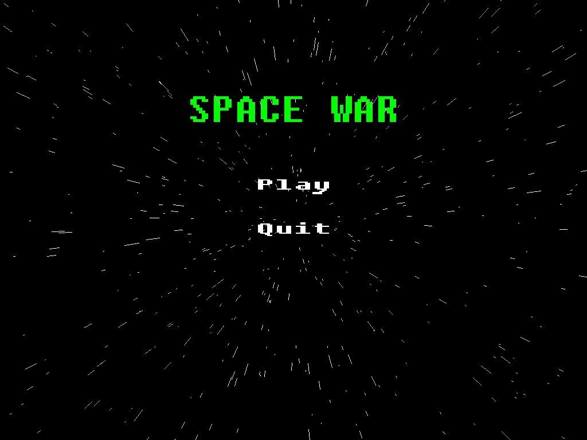
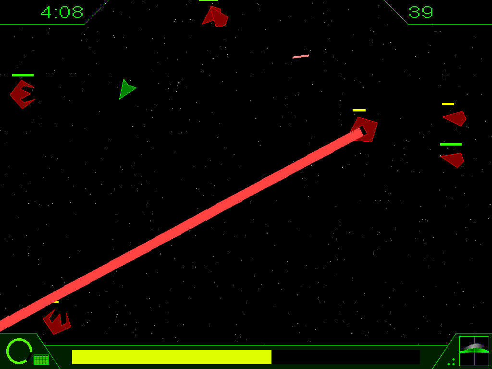
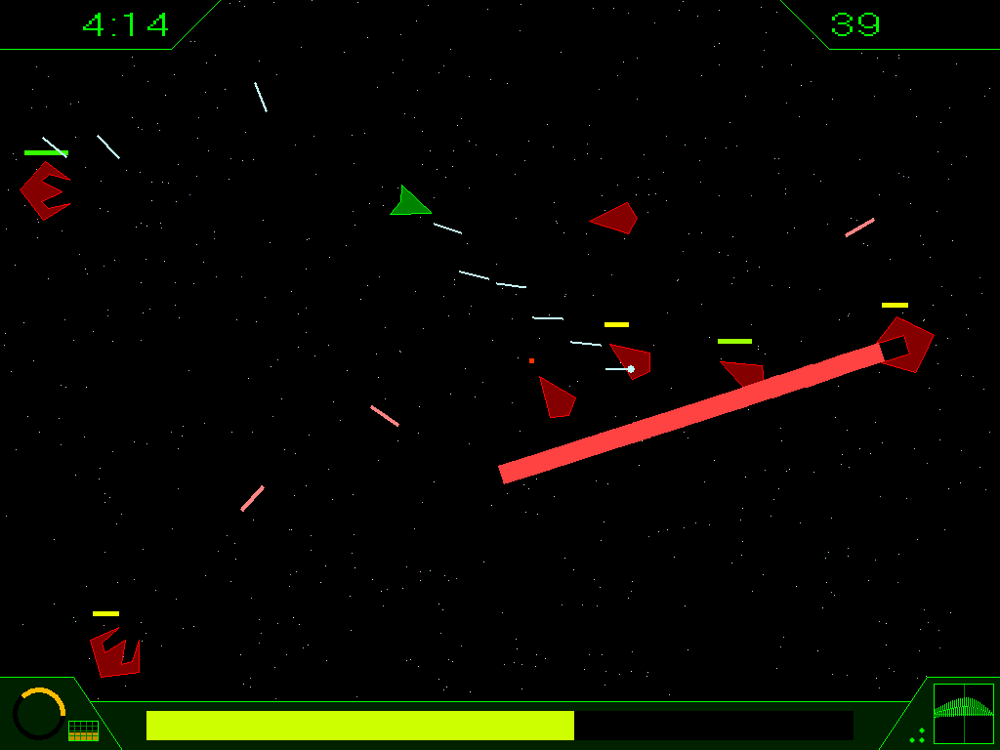
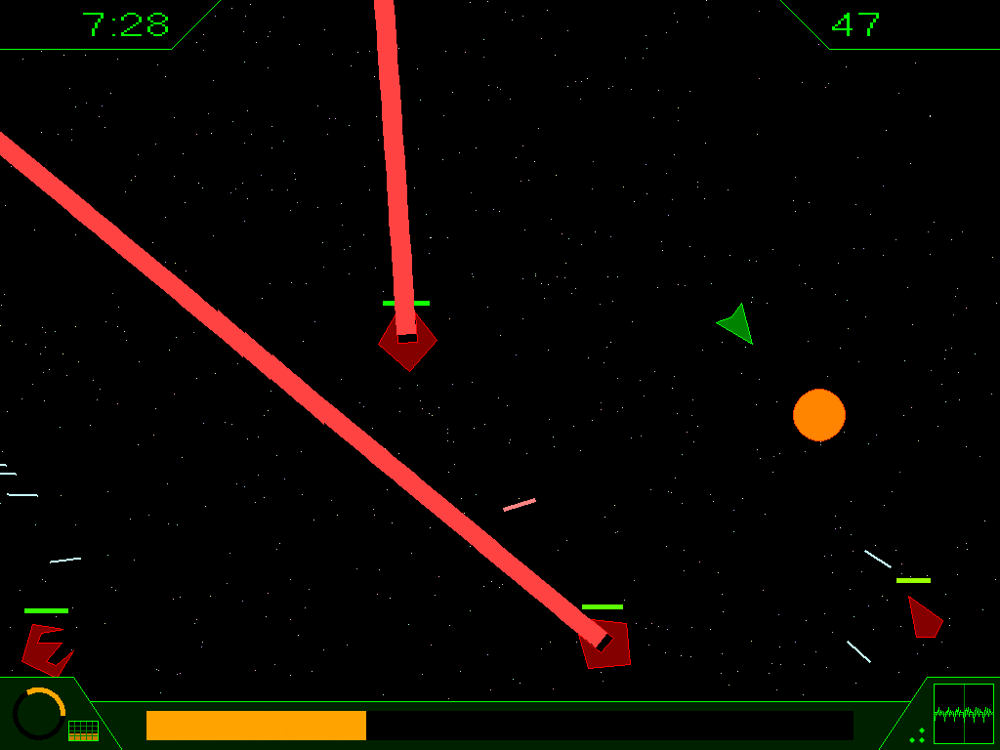

# SpaceWar
Very simple game, implemented in a week for college exam. Despite it name, it's slightly _diffirent_, than the famous game, having the same name. Uploaded here for historical purposes.

## Requirments

This project is selfsufficient. It have only one dependency (see [WinBGI lib](#winbgi-dependency)), which sources is included in [`3rdparty`](./3rdparty/winbgi) directory with appropriate cmake file.

The resulting executable can be launched on any hardware powered by Windows 7 or later (may run on earlier versions, but not tested).

## Gameplay
The overall idea is very simple: you control spaceship and you goal is live as long as possible, fighting with hordes of enemies coming from everywhere.

Actual gameplay looks like this:

### Enemies
Here described three kind of enemies, presented in the game.

- **"Bull"**: simpliest enemy in the game. His main attack is doing spurt towards player. If he's succeed to ram player, both will take damage.

- **"Turret"**: staying on the corner of battlefield, performing ranged attacks by shooting at the player.

- **"LaserWall"**: the most dangerous enemy. When he appears, he's going to some position from which  shooting laser beam, holding it for some time and stealing a big amount of available space from player. It could be passed through, but deals severe amount of damage.

## Controls
- Use `mouse` to look around, `left button` to shoot in the direction of cursor.
- Key `W` to move forward, keys `A` and `D` to move left and right respectively. All movement made according to ship orientation:

_**IMPORTANT NOTE:** keys input is handled using [WinBGI lib](#winbgi-dependency). It exposes input not by physical key codes, but rather using symbols that keys produce. Because of that, different from English QWERTY keyboard layouts (for example AZERTY, QZERTY or JCUKEN) could lead to incorrect input handling._

## Screenshots

## Exam restrictions
There are two restrictions, demanded by exam:
1. Project must contain only one file (that's the reason why all code resides in `main.cpp`).
2. Project must not have any external dependencies, except WinBGI lib (briefly explained below).

## WinBGI dependency
This lib is the only thing that we allowed to use. Actually, forced to use, if we take into account given projects themes. It represents simple high-level abstraction, based on low-level Win32API, that should give us simple interface to create window, handle input, display some graphics, etc.

### Little story about challenges of integration
College teachers gave us binaries of this lib but, unfortunately, it contained some bugs. For example, method `outtextxy` internally creates font GDI resource, but doesn't clean it after itself, which leads to hardlock of the game after it exceeds system GDI resources limit. Moreover, I've used compiler different from used in college proposed IDE, which leads to linking problems. So, I found source code, fixed bugs that I've found and placed sources as-is, because it's really hard to find them in the internet.

## Remastered version
TBD
